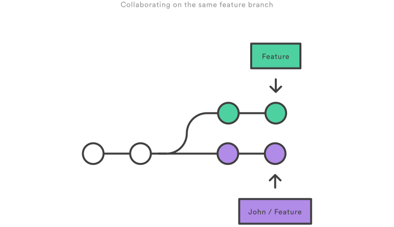
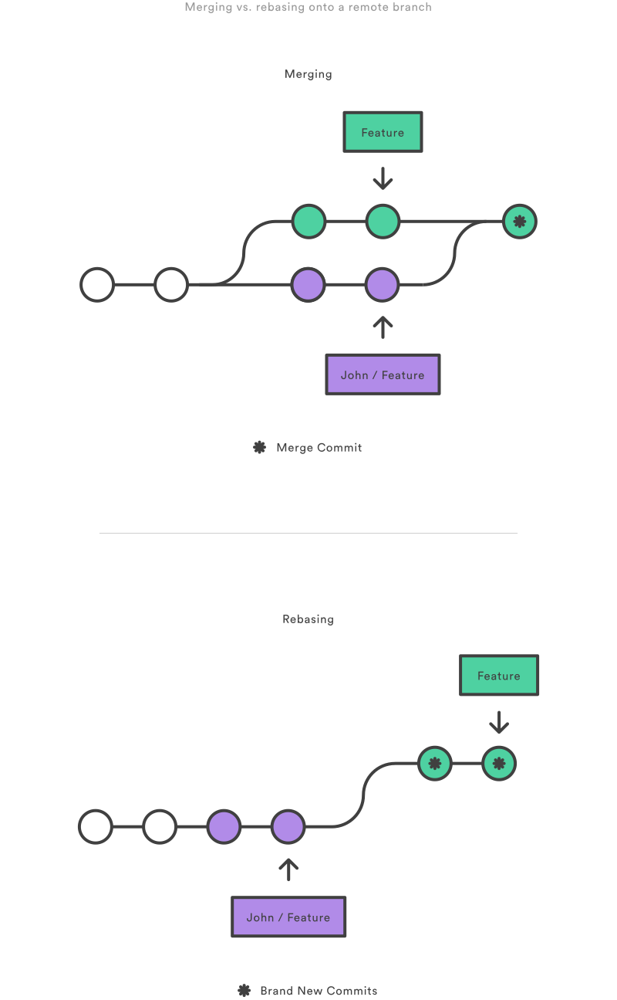
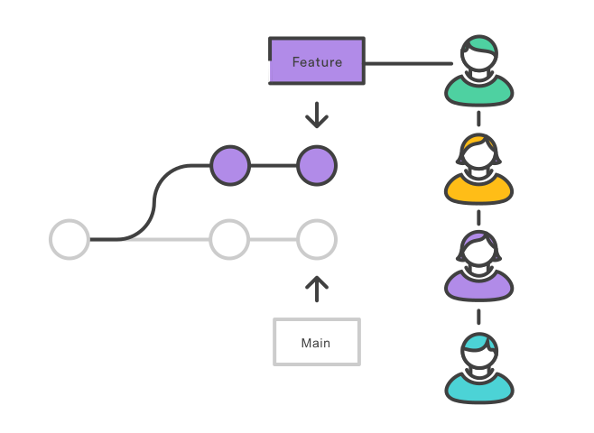

## Table of Contents

1. [Introduction](#introduction)
2. [Version Control with Git and GitHub](#version-control-with-git-and-gitHubpart-one)
3. [Combining people's work on Git](#combining-peoples-work-on-gitpart-two)
    - [Branching in Git](#branching-in-git)
    - [Getting Started](#getting-started)
    - [Merging in Git](#branching-in-git)
    - [Rebasing in Git](#rebasing-in-git)
    - [Getting Started](#getting-started)
    - [Merge vs. Rebase](#merge-vs-rebase)
4. [More on Git](#more-on-git)
5. [Pull Request](#pull-requests)
6. [Navigating a PR in Review](#navigating-a-pr-in-review)
7. [Git FAQs](#git-faqs)
8. [Conclusion](#conclusion)

# Introduction

This document aims to establish a consistent Git workflow, covering topics such as branching, making changes, committing, pushing, and creating pull requests. By adhering to these guidelines, you'll ensure that the codebase remains organized, maintainable, and scalable.

## Version Control with Git and GitHub(Part One)

This section should give a comprehensive overview of version control using Git and GitHub, along with definitions and practical exercises to reinforce learning.
### What is Version Control?
- **Definition**: A system that records changes to a file or set of files over time so you can recall specific versions later.
- **Benefits**: 
  - Tracks history of changes
  - Collaboration with multiple contributors
  - Backup and restore capabilities

### What is Git?
- **Definition**: A distributed version control system that allows multiple people to work on a project simultaneously without interfering with each other’s changes.
- **Key Features**:
  - Local repository for every user
  - Fast performance
  - Branching and merging capabilities

### What is GitHub?
- **Definition**: A web-based platform that uses Git for version control and provides a collaborative environment for developers.
- **Features**:
  - Repository hosting
  - Collaboration tools (pull requests, issues)
  - Code review and project management tools

### Key Concepts
- **Repository**: A storage location for your project's files and history.
- **Stage**: The area where changes are prepared for a commit.
- **Commit**: A recorded change to the repository.
- **Push**: Sending local commits to a remote repository.
- **Pull**: Fetching and integrating changes from a remote repository.

### Basic Operations on Git

#### Set up a repository

- Initialize or clone a repository to your local machine:
   ```
   git init
   ```
   or
   ```
   git clone [repository-url]
   ```

#### Making Changes

- Make small, focused commits that address a single issue or feature.

#### Staging and Committing Changes

- Stage changes:
  ```
  git add [file-name]
  ```
- Commit changes with a meaningful message:
  ```
  git commit -m "fix(AAiT-backend-1A): Update Login Page"
  ```

#### Pushing Changes

- Push changes to the remote branch:
  ```
  git push
  ```
### Practice Exercises
1. **Initialize and Clone a Repository**:
   - `git init` or `git clone <repository-url>`
2. **Stage and Commit Changes**:
   - Make changes to a file, then `git add <file>` and `git commit -m "Message"`
3. **Push Changes to GitHub**:
   - `git push origin main`
4. **Pull Changes from GitHub**:
   - `git pull origin main`

## Combining people's work on Git(Part Two)
- Using Git's features to manage and integrate changes from multiple contributors.


### Branching in Git


**Branch:** A separate line of development that allows you to work on a feature or fix without affecting the main codebase. It enables multiple developers to work on the same codebase without conflicting changes.


### Getting Started

1. Clone the repository to your local machine:
   ```
   git clone https://github.com/Sophinaz/git-tutorial.git
   ```

#### Commands:
- Create a new branch for each feature or bug fix:
  ```
  git branch [your-name].[task-name]
  git checkout [your-name].[task-name]
  ```
- Switch to a branch:
  ```
  git checkout branch_name
  ```
  or
  ```
  git checkout -b [your-name].[task-name]
  ```

#### Best Practices:
- Branch off from the main branch.
- Keep branches small and focused; delete them after they've served their purpose.
- Delete old branches.

### Merging in Git

- **Merge:** The process of combining changes from one branch into another.


#### How to Merge Branches:
- Checkout the branch you want to merge into (e.g., main):
  ```
  git checkout main
  ```
- Pull any changes from the remote repository:
  ```
  git pull
  ```
- Merge the other branch into the current branch:
  ```
  git merge feature-branch
  ```

#### Handling Conflicts in Git

- **Conflict:** Occurs when two or more branches have made changes to the same code in a conflicting manner.

#### How to handle conflict in Git:
- Use `git status` and `git diff` to identify conflicts.
- Resolve conflicts by editing the files manually and committing the changes.
  - Use `git add` to stage the resolved files.
  - Use `git commit` to commit the resolved changes.


#### Best Practices for Conflict Resolution:
- Communicate with your team.
- Regularly merge changes from the main branch to avoid large conflicts.
- Use a consistent code style to minimize conflicts.
- Use `git merge --abort` to cancel a merge if conflicts are too difficult to resolve.

### Rebasing in Git

**Rebase:** The process of moving a branch to a new base commit, often used to combine multiple commits into a single one.


### Getting Started

1. Clone the repository to your local machine:
   ```
   git clone https://github.com/Sophinaz/git-tutorial.git
   ```
2. Configure Git to rebase when pulling changes:
   ```
   git config pull.rebase true [--global]
   ```
3. Pull changes from the main branch:
   ```
   git pull origin main
   ```

#### Commands:
- Rebase:
  ```
  git rebase <branch-name>
  ```
- Configure Git to always rebase when pulling changes:
  ```
  git config pull.rebase true
  ```

### Merge vs. Rebase




- **Git merge:** Combines changes from one branch into another by creating a new commit.
- **Git rebase:** Integrates changes from one branch into another by replaying the changes on top of the destination branch, creating a linear history.




#### Best Practices:
- Use Git merge to preserve the history of the source branch.
- Use Git rebase for a cleaner, linear project history.


## More on Git
### Stashing in Git

- **Stash:** Temporarily save changes that are not ready to be committed, allowing you to switch branches or work on other tasks.

#### Commands:
- Stash changes:
  ```
  git stash
  ```
- List stashes:
  ```
  git stash list
  ```
- Apply a stash:
  ```
  git stash apply
  ```
- Delete a stash:
  ```
  git stash drop
  ```

### Reverting and Resetting in Git

- **Git Revert:** Creates a new commit that is the opposite of an existing commit.
  ```
  git revert <commit-id>
  ```
- **Git Reset:** Used to change the repository to a previous commit and discard any changes after that.
  ```
  git reset <commit-id>
  ```


## Pull Requests

A **Pull Request** (PR) is a way to ask another developer to merge one of your branches into their repository. This not only makes it easier for project leads to keep track of changes, but also lets developers initiate discussions around their work before integrating it with the rest of the codebase.




### Creating Pull Requests

1. **Ensure your branch is up to date with the main branch**:
   ```bash
   git pull --rebase origin main
   ```

2. **Create a pull request on GitHub**:
   - Navigate to your repository on GitHub and click the "New pull request" button.
   - Select the branch you want to merge into the main branch.
   - Add reviewers, a title, and a description for your pull request.
   - Click "Create pull request" to submit your request.
   - Wait for the pull request to be reviewed and approved by the reviewers.

3. **Address any reviewer comments** and make necessary changes.

4. **Rebase your branch with changes from the main branch before merging**:
   ```bash
   git pull --rebase origin main
   ```

5. **Merge the pull request using "Squash and Merge"** to group smaller commits.

### Pull Request Guidelines

#### General Guidelines

- The PR title should follow the commit convention, e.g., `fix: Update Login Page`.
- Ensure your branch is up to date with the main branch.
- Changes should be fully tested and pass all tests.
- Commit messages should be meaningful and follow the commit guidelines.

#### Committing

- Use simple present tense. Example: "Update Login Page".
- Add a tag (refer to “conventional commit rules”). Example: `fix: Update Login Page`.

#### Creating a Branch

- The branch name should follow the pattern `[your-name].[task-name]`.

#### Creating a PR

- Add a label when creating a pull request.

### Guideline for PR Creators

#### Small PRs

- The right size for a PR is one self-contained change. This usually involves just one part of a feature rather than an entire feature.
- Include related test code (new tests or updated tests).
- Provide all necessary context within the PR, its description, the existing codebase, or a previously reviewed PR.
- Ensure the system continues to function well for users and developers after the PR is merged.

#### Benefits of Smaller PRs

- Quicker reviews
- Easier to merge
- More thorough reviews

#### Large PRs

- Acceptable when they involve deletions of whole files or are generated by trusted automatic refactoring tools.
- Reviewers may reject large changes and request smaller, incremental changes.

## Navigating a PR in Review

**Code Review:** ensures codebase consistency, maintainability, and improvement over time.

#### Key Points of Code Review

- **Trade-offs**: Balancing progress and code quality.
- **Reviewer's Role**: Ensure changes improve the codebase.
- **"Better, Not Perfect"**: Prioritize continuous improvement.
- **Ownership**: Reviewer ensures code consistency.
- **Approval Criteria**: Changes should enhance system health.

### What to Look for in a Code Review

- Design
- Functionality
- Complexity
- Tests
- Naming & Comments
- Style & Consistency
- Documentation
- Every Line
- Positive Aspects

### Practice Exercises


1. **Take a Broad View of the Change**:
   - Review the PR description and overall purpose.
   - Determine if the change is sensible and has a clear description.

2. **Examine the Main Parts of the PR**:
   - Identify files with significant logical changes.
   - Focus on these major parts first for context.
   - Communicate any major design issues promptly.

3. **Review the Remaining Files in an Appropriate Sequence**:
   - Establish a logical order for reviewing the remaining files.
   - Check for related changes or potential impacts.
   - Send comments highlighting design issues and suggesting improvements.

### Writing Code Review Comments

- **General Guidelines**:
  - Be kind and respectful.
  - Explain your reasoning.
  - Encourage simplification of code.

- **Label Comment Severity**:
  - **Nit**: Minor issue; should be addressed but isn't critical.
  - **Optional (or Consider)**: Good idea but not required.
  - **FYI**: Not expected to be addressed in this change but useful for the future.

### Scenarios/FAQ

- **What if the developer is not responding to comments?**
  - Politely ask for a response.
  - Escalate to the team lead or manager if necessary.

- **What if I don't understand a particular piece of code?**
  - Ask the developer for clarification.

- **What if I disagree with the author's implementation?**
  - Discuss and suggest alternatives.

- **How do I ensure that the code I'm reviewing is readable?**
  - Ensure clear naming, comments, and documentation.

- **What should I look for in terms of performance and efficiency?**
  - Check for optimized and efficient code.

- **What are some common code smells to look out for?**
  - Look for anti-patterns, overly complex code, and areas needing refactoring.
## Git FAQs

Refer to the Git FAQs section for answers to common Git-related questions.

## Conclusion

Congratulations! You have completed the Git Workflow Guide. By following these best practices, you contribute to a well-organized, maintainable, and scalable codebase. If you encounter any questions or issues, don't hesitate to reach out to your team leader for assistance. Happy coding!

